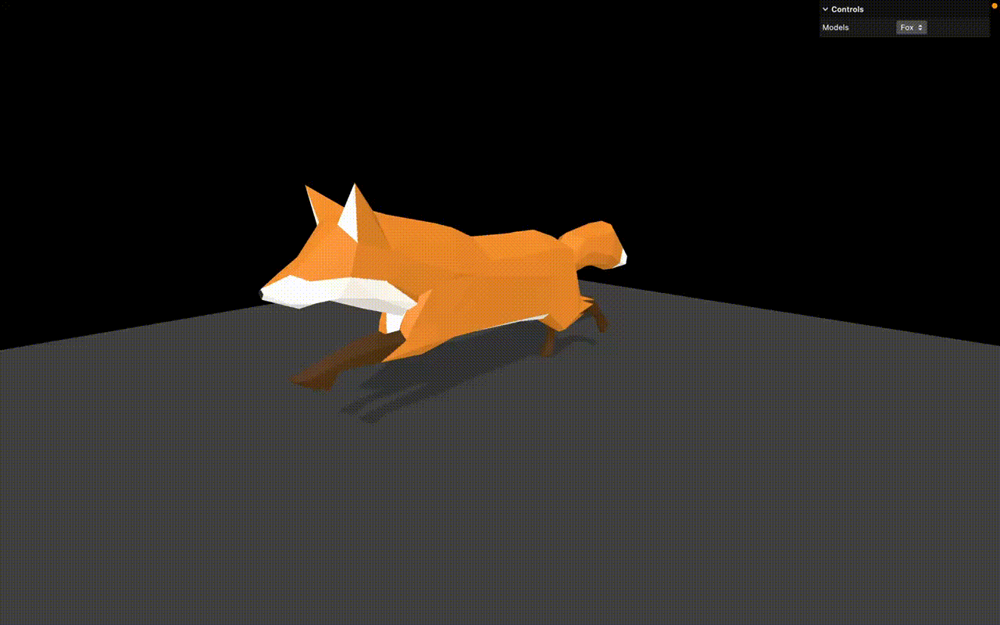

# 🦊 Three.js – Visualiseur de Modèles 3D Importés 🦆🦖

Sélection et affichage de divers modèles 3D, créé avec [Three.js](https://threejs.org/).



## 🚀 Démo

[Voir la démo](https://rekuiem84.github.io/3d-models-showcase/)

## ✨ Fonctionnalités

### 📦 Gestion de Modèles 3D

- Support des formats GLTF et GLB
- Compression DRACO pour des modèles optimisés
- Chargement dynamique avec interface de sélection
- Gestion automatique de l'échelle et du positionnement

### 🎬 Système d'Animation

- Support des animations intégrées aux modèles GLTF
- Gestion intelligente des modèles avec/sans animations
- Lecture automatique des animations au chargement

### 🎮 Interface Interactive

- Contrôles de caméra libre (OrbitControls)
- Interface de debug (lil-gui) pour sélection de modèles
- Gestion des erreurs avec messages dans la console

## 📋 Modèles Disponibles

- **Duck** : Modèle de démonstration classique
- **Fox** : Modèle avec une animation de course
- **Flight Helmet** : Casque de pilote haute définition
- **Upcycled Computer** : Ordinateur avec animation de guitare
- **Dinosaur Skull** : Crâne de dinosaure détaillé
- **Dinosaur Skeleton** : Squelette complet de dinosaure
- **Eva 01** : Modèle Evangelion 01 avec animation d'ambiance
- **Eva 02** : Modèle Evangelion 02 statique dans une scène mythique
- **Leliel** : Ange géométrique d'Evangelion
- **Wuhu Island** : Île du jeu Wii Sports Resort

## 🎨 Crédits des Modèles

- **Duck** : Créé par Sony Computer Entertainment Inc.
- **Fox** : [Model par PixelMannen](https://opengameart.org/users/pixelmannen) et [animation par tomkranis](https://sketchfab.com/tomkranis)
- **Flight Helmet** : Créé par Microsoft
- **Upcycled Computer** : [Créé par Seafoam](https://sketchfab.com/seafoam)
- **Dinosaur Skull** : [Créé par rankinstudio](https://sketchfab.com/rankinstudio)
- **Dinosaur Skeleton** : [Créé par Pomona Pictures](https://sketchfab.com/PomonaPictures)
- **Eva 01** : [Créé par kurtchangart](https://sketchfab.com/kurtchangart)
- **Eva 02** : [Créé par Mateusz Woliński](https://sketchfab.com/jeandiz)
- **Leliel** : [Créé par Nicolás Sazo](https://sketchfab.com/GhostRonin)
- **Wuhu Island** : [Créé par Noah the Fire Tiger](https://sketchfab.com/smiN5214)

Toutes les licenses sont disponibles dans les dossiers respectifs des modèles

## 🛠️ Installation & Lancement

1. **Cloner le dépôt :**

   ```bash
   git clone https://github.com/Rekuiem84/3d-models-showcase
   cd 3d-models-showcase
   ```

2. **Installer les dépendances :**

   ```bash
   npm install
   ```

3. **Lancer le serveur de développement :**

   ```bash
   npm run dev
   ```

4. **Build pour la production :**

   ```bash
   npm run build
   ```

   Les fichiers optimisés seront générés dans le dossier `dist/`.

## 📁 Structure du projet

```
├── src/           # Fichiers sources
├── static/
│   ├── draco/         # Décodeurs DRACO pour la compression
│   └── models/        # Modèles 3D GLTF/GLB organisés par dossiers
├── package.json       # Dépendances et scripts
└── vite.config.js     # Configuration Vite
```

## ▶️ Utilisation

### 🎮 Contrôles de Base

- **Souris** : Rotation, zoom et panoramique de la caméra
- **Menu déroulant "Models"** : Sélection du modèle à afficher

## 🔧 Fonctionnalités techniques

### Chargement de Modèles

- Chargement asynchrone avec gestion d'erreurs robuste
- Support automatique de la compression DRACO
- Fallback sans DRACO en cas d'échec
- Mise à l'échelle et positionnement initial automatiques
- Gestion des ombres pour tous les meshs

### Optimisations

- Compression DRACO pour réduire la taille des fichiers
- Chargement à la demande des modèles
- Nettoyage automatique de la scène lors du changement de modèle
- Gestion efficace de la mémoire

## 🔗 Mes autres projets Three.js

- [Repo Three.js Journey principal](https://github.com/Rekuiem84/threejs-journey) — pour retrouver tous mes projets suivant ce parcours
